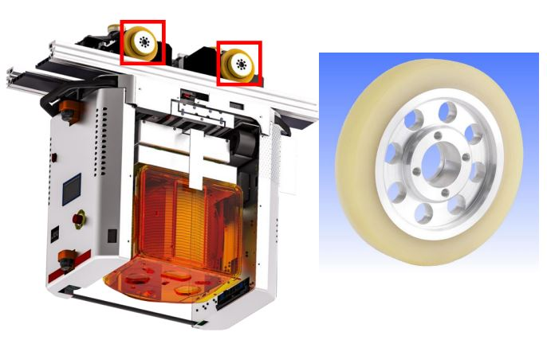

# SEMAI: 이미지 기반 볼트 이상 진단 AI
> **⭐️ SEMES 기업 연계 프로젝트**<br>
> **⭐️ SSAFY 자율 프로젝트 2위 수상(148개 팀 中)**

<hr>

## SEMAI 서비스 개요
- **`SEMAI`는 크게 네 가지 주요 기능을 탑재한 프로그램이다.**
  1. 이미지 기반 OHT 휠(wheel) 볼트 이상 진단 기능
  2. 전이학습 기능
  3. 레포트 기능
  4. AI 분석 기능
- **OHT란?**
  - Overhead Hoist Transport의 약자로, 반도체 공장에서 천장 레일을 통해 반도체 소재를 옮기는 장비이다.
  - 삼성전자 P1라인에만 1850대의 OHT가 가동되고 있다([관련 기사](https://www.inews24.com/view/1517772)).
  - OHT와 OHT 휠
    <span style="color:red;">* 보안 문제로 README에서 실제 휠 및 볼트 사진은 사용이 불가.</span>
    
    - [oht 사진 출처](http://news.heraldcorp.com/view.php?ud=20220908000699)
    - [oht 휠 사진 출처](http://krcaster.co.kr/goods/minutely.php?goods_id=2684)
- **SEMAI의 필요성**
  - OHT 휠에 대한 정확하고 효율적인 점검을 위해 데이터 기반 OHT 휠 볼트 사전 이상 예방 시스템의 필요성이 대두되었다.

<hr>

## 주요 기능 소개
<span style="color:red;">* 각 기능의 개발 상세 내용은 `ai`, `backend`, `frontend` 폴더 내에서 확인 가능.</span>

### 1. 이미지 기반 볼트 이상 진단 기능
- 휠 이미지가 input으로 들어오면 휠 내 볼트를 탐지하여 **볼트 이미지를 추출**하고, 추출된 이미지들을 분류 모델에 넣어 **정상/유실/파단/풀림**을 분류한다.  
  

- **볼트 이상 진단 시스템 구성도**  
    
  ①	휠 이미지가 촬영되면 해당 이미지가 Spring Boot로 전달된다.  
  ②	Spring Boot에서 Fast API로 해당 이미지에 대한 볼트 이상 진단 요청을 보낸다.  
  ③	볼트 이상 진단 결과를 응답한다.  
  ④	대시보드에 업데이트 될 데이터를 전송한다.  
  ⑤	최근 진단 내역을 대시보드에 업데이트한다.  
  ⑥	최근 진단 내역을 사용자가 확인한다.

<br>

### 2. 전이학습 기능
- SEMAI가 동작하며 쌓이는 **클래스별(정상/유실/파단/풀림) 볼트 데이터를 가지고 전이학습을 수행**하는 기능이다.
- **전이학습 시스템 구성도**  
    
  
  ①	전이학습 페이지로 이동한다.  
  ②	전이학습에 사용할 이미지 선택 및 학습 하이퍼파라미터를 설정한다.  
  ③	전이학습을 요청한다.  
  ④	전이학습을 진행시킨다.  
  ⑤	전이학습 완료 후 결과를 반환한다.  
  ⑥	전이학습 결과를 반환한다.  
  ⑦	전이학습 결과 알림을 띄운다.  
  ⑧	전이학습 결과 알림을 확인한다.

<br>

### 3. 레포트 기능
- **볼트 이상 진단 기록**을 자세히 확인할 수 있다.
- 검사 기간 설정, 정렬 등으로 원하는 기록만 추출할 수 있고, CSV 파일로 기록을 다운로드 할 수 있다.
- **레포트 시스템 구성도**  
  
    
  ①	레포트 페이지로 이동한다.  
  ②	볼트 이상 진단 결과 데이터를 조회한다.  
  ③	볼트 이상 진단 결과 데이터를 요청한다.  
  ④	볼트 이상 진단 결과 데이터를 반환한다.  
  ⑤	사용자가 조회한 내역을 보여준다.  
  ⑥	사용자가 조회한 내역을 확인한다.

<br>

### 4. AI 분석 기능
- 당원 누적 이상 볼트 개수가 정상 범주를 벗어난 **이상(anomaly) 휠의 리스트**를 확인할 수 있다.
- 최근 52주 불량 볼트 데이터를 바탕으로 예측된 **차주 교체 예상 휠 개수**를 확인할 수 있다.
- **AI 분석 시스템 구성도**  

    
  ①	AI 분석 페이지로 이동한다.  
  ②	이상 위험 휠, 차주 교체 예상 휠 데이터를 요청한다.  
  ③	이상 위험 휠, 차주 교체 예상 휠 데이터를 반환한다.  
  ④	이상 위험 휠 및 차주 교체 예상 휠 개수, 이상 위험 휠 표 및 이상 볼트 개수 3차원 그래프를 보여준다.  
  ⑤	AI 분석 결과를 확인한다.

<hr>

## 팀 소개


<hr>

## 기술스택
<div align="center">
    <h4>⭐️ Platforms & Languages ⭐️</h4>
    
    
    
    <br>
    
    
    
    <br>
    
    
    
</div>

<br>

<div align=center>
	<h4>🛠 Tools 🛠</h4>
</div>
<div align=center>
	
	
	<br>
	
	
	
    
    
</div>

<hr>

## Conventions
### 1. Git Convention
<details>
<summary>📌 커밋 메시지 컨벤션</summary>

:bug: [BE] 레포트 디테일 데이터 수정 S08P31A301-652
깃모지 - [파트] - 내용 - 이슈 번호
### 🖤 규칙에 맞는 좋은 커밋메시지를 작성해야 하는 이유

- 팀원과의 소통
- 편리하게 과거 추적 가능
- 나중에 실무에서 익숙해지기 위해

### 🖤 한 커밋에는 한 가지 문제만!

- 추적 가능하게 유지해주기
- 너무 많은 문제를 한 커밋에 담으면 추적하기 어렵다.

### 🖤 CLI에서 커밋 메시지 여러 줄로 작성하는 방법

- 쌍따옴표를 닫지 말고 개행하며 작성 → 다 작성한 후에 쌍따옴표를 닫으면 작성 완료

```bash
git commit -m "FEAT: 회원가입 기능 추가

- 회원가입 기능 추가"
```

### 1. 커밋 유형 지정

- 커밋 유형은 깃모지로 대체
    
    
    | 커밋 타입 | 의미 |
    | --- | --- |
    | :sparkles: | 새로운 기능에 대한 커밋 |
    | :bug: | 버그 수정에 대한 커밋 |
    | :lipstick: | CSS 등 사용자 UI 디자인 변경 |
    | :recycle: | 코드 리팩토링에 대한 커밋 |
    | :art: | 스타일 (코드 형식 변경: 비즈니스 로직에 변경 없음) |
    | :memo: | 문서 추가, 수정에 대한 커밋 |
    | :hammer: | 빌드 관련 파일 수정에 대한 커밋 |
    | :truck: | 파일 혹은 폴더명을 수정하거나 옮기는 작업만인 경우 |
    | :fire: | 파일을 삭제하는 작업만 수행한 경우 |
    | :rocket: | CI 관련 설정, 수정에 대한 커밋  |
    | :speech_balloon: | 필요한 주석 추가 및 변경 |
    | :twisted_rightwards_arrows: | 브랜치 합병 |

### 2. 제목과 본문을 빈행으로 분리

- 커밋 유형 이후 제목과 본문은 한글로 작성하여 내용이 잘 전달될 수 있도록 할 것
- 본문에는 변경한 내용과 이유 설명 (어떻게 보다는 무엇 & 왜를 설명)

### 3. 제목 첫 글자는 대문자로, 끝에는 `.` 금지

### 4. 제목은 영문 기준 50자 이내로 할 것

### 5. 자신의 코드가 직관적으로 바로 파악할 수 있다고 생각하지 말자

### 6. 여러가지 항목이 있다면 글머리 기호를 통해 가독성 높이기

</details>

<details>
<summary>📌 git flow</summary>

## 📌 git flow
__작업하는 동안 default branch는 develop__.

✅ pr 날릴 때 어디로 날리는 건지 꼭 체크하기!

### **main → develop → feature-지라 이슈 번호**

main은 모든 작업이 끝난 후 develop에서 merge 시킨다.
—————————————————————————
- main - 초기 세팅 존재
- develop - local 작업 완료 후 merge 브랜치
- feature지라 이슈 번호 - 작업 브렌치
- local/feature-지라 이슈 번호 - 각자의 기능 추가 브랜치 → ex) feature-S08P31A301-652

—————————————————————————

1. `local - feature` 에서 각자 기능 작업
2. 작업 완료 후 `remote - develop` 에 PR
3. **코드 리뷰 후 Confirm 받고 Merge**
4. remote - develop 에 Merge 될 때 마다 **모든 팀원 remote - develop pull** 받아 최신 상태 유지

main → develop → feature/내용, fix/내용, refactor/내용
</details>

<br>

## 2. 코딩 컨벤션
<details>
<summary>📌 FrontEnd</summary>

## 1. **NAMING CONVENTIONS**

- **components 이름은 Pascal Case로 작성한다.**
- **Non-components 이름은 Camel Case로 작성한다.**

## 2. **BUG AVOIDANCE**

- null **또는 undefined일 수 있는 값은 optional chaining 연산자 (?.)를 사용한다.**

## 3. **ARCHITECTURE & CLEAN CODE**

- **유틸리티 파일을 만들어 중복된 코드를 피한다.**
- **Presentational 컴포넌트와 Container 컴포넌트를 분리하여 사용한다.**
- **고차 컴포넌트(Higher Order Components, HOC)는 적절하게 사용한다.**
- **JS, test, css로 파일을 분리한다.**
- **불필요한 주석을 사용하지 않는다.**
- **현재 화면보다 긴 코드는 더 작은 단위의 코드로 리팩토링 한다.**
- **주석 처리된 코드는 커밋하지 말고 삭제한다.**

## 4. **ES6**

- **class component가 아닌 function component를 사용한다.**
- **JSX 문법을 사용한다.**
- **spread 연산자를 사용한다.**
- **구조 분해 할당을 사용한다. let과 const만 사용한다. (var 사용금지)**
- **되도록 화살표 함수를 사용한다.**
- **직접 null을 체크하기 보다 optional chaining 연산자 (?.)를 사용한다.**

## 5. **TESTING**

- **테스트를 작성한다.**
- **적정 수준의 테스트 커버리지를 유지한다.**
- **하나의 테스트 파일에서 하나만 테스트 한다.**
- **테스트 코드안에서 로직을 사용하지 않는다.**
- **테스트 클래스는 하나의 클래스만 테스트 한다.**
- **네트워크, 데이터 베이스와 직접 통신하지말고 가짜 함수를 사용한다.**

## 6. **CSS**

- **inline css를 사용하지 않는다.**
- **명명 규칙을 지킨다.**

참고 : [https://www.jondjones.com/frontend/react/react-tutorials/react-coding-standards-and-practices-to-level-up-your-code/](https://www.jondjones.com/frontend/react/react-tutorials/react-coding-standards-and-practices-to-level-up-your-code/)
</details>

<details>
<summary>📌 BackEnd</summary>

## ☑️ 코드 컨벤션

```bash
문자열을 처리할 때는 쌍따옴표를 사용하도록 합니다.
```

```bash
문장이 종료될 때는 세미콜론을 붙여줍니다.
```

```bash
🐫 함수명, 변수명은 카멜케이스로 작성합니다.
```


```bash
🥙 URL, 파일명은 케밥케이스로 작성합니다.
```


```bash
☝ 가독성을 위해 한 줄에 하나의 문장만 작성합니다.
```

```bash
주석은 설명하려는 구문에 맞춰 들여쓰기 합니다.

// Good
function someFunction() {
  ...

  // statement에 관한 주석
  statements
}
```


```bash
연산자 사이에는 공백을 추가하여 가독성을 높입니다

a+b+c+d // bad
a + b + c + d // good
```

</aside>

```bash
☝ 콤마 다음에 값이 올 경우 공백을 추가하여 가독성을 높입니다.

var arr = [1,2,3,4]; //bad
var arr = [1, 2, 3, 4]; //good
```

```bash
🔠 생성자 함수명의 맨 앞글자는 대문자로 합니다.

function Person(){}
```

```bash
🔠 ENUM이나 상수는 대문자로 합니다.

NORMAL_STATUS = 10;
```

```bash
🔠 함수명은 소문자로 시작하고 동사로 합니다.

function getUserId(){}
```

---

### ☑️ **Structure**

1. **패키지는 목적별로 묶는다.**
    - common(공통기능 관련 패키지), user(User 관련 패키지), coupon(쿠폰 관련 패키지)
2. **Controller에서는 최대한 어떤 Service를 호출할지 결정하는 역할과 Exception처리만을 담당하자.**
    - Controller 단에서 로직을 구현하는 것을 지양한다.
3. **하나의 메소드와 클래스는 하나의 목적을 두게 만든다.**
    - 하나의 메소드 안에서 한가지 일만 해야한다.
    - 하나의 클래스 안에서는 같은 목적을 둔 코드들의 집합이여야한다.
4. **메소드와 클래스는 최대한 작게 만든다.**
    - 메소드와 클래스가 커진다면 하나의 클래스나 메소드 안에서 여러 동작을 하고 있을 확률이 크다.
    - 수많은 책임을 떠안은 클래스를 피한다. 큰 클래스 몇 개가 아니라 작은 클래스 여럿으로 이뤄진 시스템이 더욱 바람직하다.
    - 클래스 나누는 것을 두려워하지 말자.
5. **도메인 서비스를 만들어지는 것을 피하자.**
    - User라는 도메인이 있을 때, UserService로 만드는 것을 피한다.
    - 이렇게 도메인 네이밍을 딴 서비스가 만들어지면 자연스레 수많은 책임을 떠안은 큰 클래스로 발전될 가능성이 높다.
    - 기능 별로 세분화해서 만들어보자. (UserRegisterService, UserEmailService 등...)
6. **에러 검출(try - catch)**
    - 최상단에서 에러 검출 하기
    - ex) 컨트롤러 서비스 DAO가 있으면  컨트롤러에서 try -catch문 작성

## 🍃 스프링부트 네이밍 컨벤션

<aside>


### ▶ Controller

- 컨트롤러 클래스 안에서 메서드 명을 작성 할 때는 아래와 같은 접미사를 붙인다.
    
    
    | 메서드명 | 의미 |
    | --- | --- |
    | orderList() | 목록 조회 유형의 서비스 |
    | orderDetails() | 단 건 상세 조회 유형의 controller 메서드 |
    | orderSave() | 등록/수정/삭제 가 동시에 일어나는 유형의 controller 메서드 |
    | orderAdd() | 등록만 하는 유형의 controller 메서드 |
    | orderModify() | 수정만 하는 유형의 controller 메서드 |
    | orderRemove() | 삭제만 하는 유형의 controller 메서드 |

### ▶ ****Service****

- 서비스 클래스 안에서 메서드 명을 작성 할 때는 아래와 같은 접두사를 붙인다.
    
    
    | 메서드명 | 의미 |
    | --- | --- |
    | findOrder() | 조회 유형의 service 메서드 |
    | addOrder() | 등록 유형의 service 메서드 |
    | modifyOrder() | 변경 유형의 service 메서드 |
    | removeOrder() | 삭제 유형의 service 메서드 |
    | saveOrder() | 등록/수정/삭제 가 동시에 일어나는 유형의 service 메서드 |

### ▶ Mapper

- Mapper 클래스 안에서 메서드 명을 작성 할 때는 아래와 같은 접두사를 붙인다.
    
    
    | 메서드명 | 의미 |
    | --- | --- |
    | selectOrder() | 조회 유형의 mapper 메서드 |
    | insertOrder() | 등록 유형의 mapper 메서드 |
    | updateOrder() | 변경 유형의 mapper 메서드 |
    | deleteOrder() | 삭제 유형의 mapper 메서드 |

</aside>
</details>
<br>

## 3. DB 컨벤션
<details>
<summary>📌 DB 컨벤션</summary>

## **1. 약어 사용 자제**

## **2. 테이블, 칼럼명은 모두 단수**

## **3. 테이블명은 카멜 케이스**
ex.) 
- 두 개 이상의 단어를 조합해서 쓸 때는 카멜케이스로 쓴다.
- 한 단어일때는 소문자로 적는다.

## **4. 칼럼명은 스네이크 케이스**


**1. idx**

idx는 테이블명_idx로 하도록 한다.

**2. 예약어는 칼럼명으로 사용하지 않는다.**

 ex) 난이도 테이블의 값 : value = X

**3.이분법으로 나눠지는 값은 is‘_‘사용**
</details>

<details>
<summary mmary>📌 명명 규칙의 중요성</summary>

  #### ☑️ 이름은 오래간다.

  데이터 구조는 어플리케이션 코드보다 훨씬 지속력이 높다. 
  잘 정의된 데이터 구조와 테이블 레이아웃은 어떠한 어플리케이션에서도 사용되어질 수 있다. 즉, **데이터 구조는 한번 잘 짜 놓든 아니든 영향력이 오래간다.**

  #### ☑️ 이름은 계약이다.

  한번 컬럼이나 테이블 이름을 정해 놓으면 어플리케이션에서는 그 이름을 코딩으로 사용한다. 
  **만약 컬럼과 테이블의 이름이 변경된다면 의존하고 있던 어플리케이션에서도 수정**이 일어나야 한다.

  #### ☑️ 개발자 환경의 차이.

  이름이 잘 정의된 테이블, 뷰, 컬럼이 있다면 **본인 뿐만 아니라 다른 개발자들도 데이터베이스의
  구조를 이해하는데 짧은 시간이 소모**될 것이다.
</details>