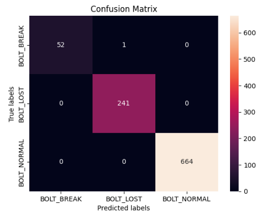

# [SEMES] - 볼트 이상 탐지 분류 모델

- model : RegNet1.6

- criterion : CrossEntropyLoss

- optimizer : Adam
  
  - Learning rate = 0.001

-  Result
  
  - 학습 데이터셋 크기: 3598
  
  - 테스트 데이터셋 크기: 958(실제 SEMES 데이터 558 / 실제 환경에 맞춘 데이터 400)
  
  - 클래스: ['BOLT_BREAK', 'BOLT_LOST', 'BOLT_NORMAL']
  
  - - P(Precision) : 모델이 True라고 분류한 것 중 실제 True인 것의 비율
      - BOLT_BREAK : 100 %
      
      - BOLT_LOST : 99.59%
      
      - BOLT_NORMAL : 100%
    - R(Recall): 실제 True인 것 중에서 모델이 True라고 에측한 것의 비율
      - BOLT_BREAK : 98.11%
      
      - BOLT_LOST : 100%
      
      - BOLT_NORMAL : 100%
  
  - Acc: 99.8956%
  
  - Loss: 0.0029
    
    

